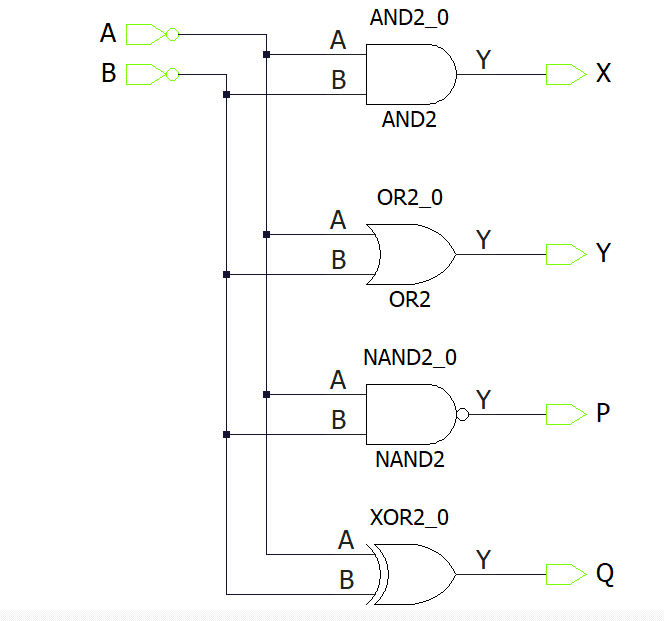

## Basic Combinational Gates Project
In this tutorial we followed, we were able to complete to program simple gates. We followed the tutorial from [this](https://microchipdeveloper.com/fpgadt:libero-getting-started) tutorial webpage. Though this is not meant for the PolarFire Icicle Kit, this can e used for general Libero Usage. As mentioned in the guide, this part is divided into 6 "Lessons", starting from creating a design to programming it on the FPGA kit. There are around 37 steps in the origial guide, which won't be completely discussed here, but only the part what we implemented will be put here.
### Lesson 1 - Creating the PolarFire Project
Here, we create a simple Project called "BasicGatesProject", whose folder will be uploaded here. Anyone who is interested to replicate the results, just download the folder and open the ".prjx" file, which should automatically open the project in Libero SoC. Completes step 1-3 as mentioned in the guide. In step 4, since we are using a different board, we are choosing a different settings. They are as mentioned below:
* Family: PolarFire
* Die: MPFS250T_ES
* Package: FCVG484
* Speed: -1
* Range: EXT

In the device settings part, everything is left as default, which is shown in the image below

We are not adding HDL Sources and Constraints in this project, so just select the 'finish' option for the creation of the project. Here, we are done with the first part of the project
### Lesson 2 - Creating the Design
Following the steps from 1-4, we created a SmartDesignFile called BasicGates, which is as shown in the schematic

We then complete step 6-9, which gives us the BasicGates file in Design Hierarchy tab. Make sure, that your design is set as root, as it important for the next step of synthesis.
### Lesson 3 - Synthesis and Pin Assignment

TODO: Add part about doing the pre-synthesis design using a smart testbench

After the simulation, follow the steps from 1-3 as in the design guide. But from there, on choose a little differently as required for the PolarFire Board. They are to be modified as follows

* A -> W18
* B -> W19
* P -> T12
* Q -> AB19
* X -> V14
* Y -> U13

These are chosen specifically for the FPGA board, as mentioned in the MPFS-ICICLE-KIT-ES-Schematics.pdf in the main repository. In there, in page 13 and Bank 0, it in the mentioned about the 4 Switch inputs and 4 LED outputs.

Complete step 7 and exit from the IO Constraint Editor. Complete step 8 and we will have completely finished the design and synthesis part. Only the hardware manipulation of the FPGA will be left out. This will be covered in the next steps.

### Lesson 4 - Programming the Design

### Lesson 5 - Running the Design

### Lesson 6 - Design Iterations in Libero SoC PolarFire

